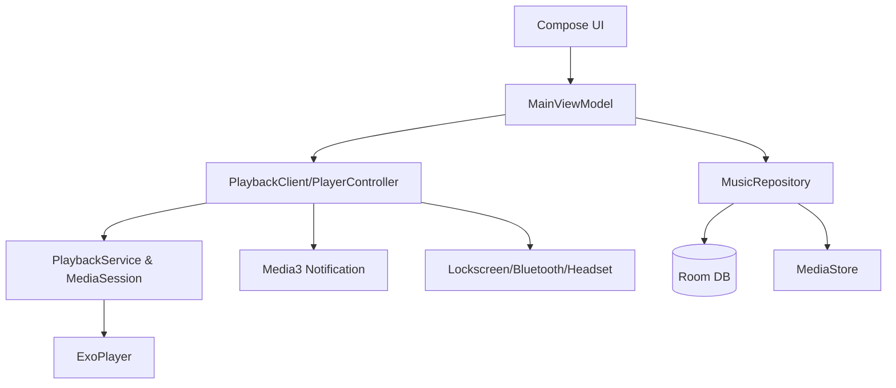

# Smart Playlist Player

Smart Playlist Player is a local-first Android music player that blends fast offline scanning with a smart rule engine
for building mood-aware queues. It is built with Jetpack Compose, Media3, Room, and MVVM so playback stays stable
in the background while the UI remains lightweight.

The app focuses on a tight, reliable playback experience: background-safe audio, notification controls, and
intelligent queues driven by your listening history and favorites.

## Features
- [x] Local scan via MediaStore
- [x] Tap-to-play list with current track display
- [x] Favorites and rule-based smart queue
- [x] Background playback with MediaSession
- [x] Notification controls (play/pause/prev/next)
- [x] Lock screen, Bluetooth, and headset button support
- [x] Play history with START/PAUSE/SKIP/COMPLETE events
- [x] Full Now Playing screen with seek and queue preview

## Screenshots
> Placeholders are included. Replace them with real screenshots following the steps below.


### How to capture screenshots
1. Run the app on a device or emulator.
2. Navigate to each screen.
3. Use Android Studio > Take Screenshot (or device screenshot shortcut).
4. Save images to `docs/images/` using the exact file names above.

## Now Playing
The Now Playing page shows full track details, a live progress bar with seek, playback controls, and a queue preview.
It stays in sync with MediaSession so lock screen and notification actions are reflected instantly.

## Architecture
Mermaid source (export a PNG to `docs/architecture/architecture.png`):




Playback state flows from `MediaController` to `PlaybackService` and `ExoPlayer`. `PlayerController` exposes
state flows to the UI so Now Playing and Home stay in sync with the same source of truth.
The position ticker lives inside `PlayerController` to keep progress updates aligned with the actual player
and avoid any UI-side polling drift.

## Permissions
- `READ_MEDIA_AUDIO` (Android 13+): read local audio files.
- `READ_EXTERNAL_STORAGE` (Android 12 and below): read local audio files.
- `POST_NOTIFICATIONS` (Android 13+): show playback notification.
- `FOREGROUND_SERVICE` / `FOREGROUND_SERVICE_MEDIA_PLAYBACK`: background playback stability.

## Usage
1. Install and open the app.
2. Grant audio permission when prompted.
3. Tap "Scan Local Music" to import local tracks.
4. Tap a track to play it immediately.
5. Tap the same track to pause or resume.
6. Tap "Open Now Playing" to view full controls.
7. Drag the progress slider to seek.
8. Tap any upcoming track in the queue preview to jump.
9. Toggle favorites using the "Fav/Unfav" button in the list.
10. On Android 13+, grant notification permission when prompted.
11. Select a scene (Morning/Commute/Night).
12. Tap "Generate Smart Queue & Play" to start the smart queue.
13. Use the notification for play/pause/previous/next.
14. Lock screen or Bluetooth controls will mirror the MediaSession state.

## FAQ
**Q: I cannot scan any songs.**
- Make sure audio permission is granted and the device has local audio files.

**Q: Notification controls do not appear.**
- On Android 13+, grant notification permission. Also verify battery optimizations are not blocking the app.

**Q: Playback stops in the background.**
- Some OEMs aggressively kill background apps. Add the app to battery optimization exceptions.

**Q: Bluetooth/headset buttons do nothing.**
- Confirm a track is playing and the system recognizes the headset as a media device.

**Q: Xiaomi/澎湃系统/MIUI 后台限制导致停止播放？**
- 将应用加入系统的省电/后台限制豁免名单（设置为“不受限制/允许后台运行”）。
- 允许应用自启动与后台运行权限。
- 在最近任务中锁定应用，避免被系统清理。

## Roadmap
- [x] Now Playing screen with progress and queue preview
- [x] Release/AAB/Play Store preparation
- [ ] Publish on Play Store
- [ ] Equalizer / audio effects
- [ ] Rule editor UI

## Build & Release (Detailed)

### Android Studio
- Debug APK: Run the `app` configuration.
- Release APK: Build > Generate Signed Bundle/APK > APK.
- Release AAB: Build > Generate Signed Bundle/APK > Android App Bundle.

### Command Line
- Debug APK: `./gradlew assembleDebug`
- Release APK: `./gradlew assembleRelease`
- Release AAB: `./gradlew bundleRelease`

### Keystore Setup
1. Copy `keystore.properties.example` to `keystore.properties`.
2. Fill in your keystore path and passwords.
3. Keep `keystore.properties` and the `.jks` file out of git.

### Create Keystore (keytool)
```bash
keytool -genkeypair -v -keystore release.jks -keyalg RSA -keysize 2048 -validity 10000 -alias release
```

### Path Examples
- Windows example: `C:/keys/release.jks`
- macOS example: `/Users/you/keys/release.jks`

### storeFile Recommended Format and Pitfalls
- Recommended: use an absolute path or a path relative to the project root.
- Example: `storeFile=../keystore/release.jks`
- Pitfalls: backslashes on Windows can break parsing; use forward slashes.
- If using a relative path, verify it resolves from the root project folder.

### R8 / Proguard
- Release builds enable minify by default.
- If a release crash occurs, check the stack trace and add targeted keep rules in `app/proguard-rules.pro`.

### Release Steps (Full Checklist)
See `docs/store/release_steps.md`.

## Privacy
This app does not use network access. It only reads local audio metadata and stores play statistics locally in Room.

## License
MIT. See `LICENSE`.
