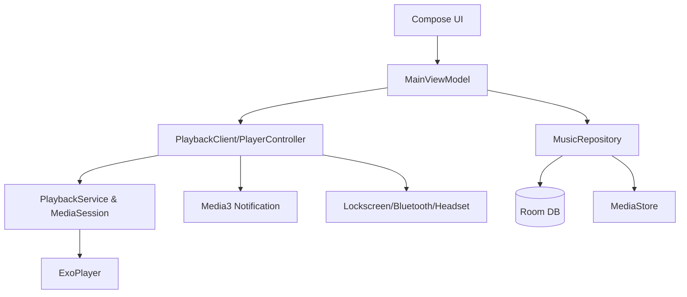

# Architecture Diagram

Below is a Mermaid diagram source. Export it to `docs/architecture/architecture.png` using Mermaid Live Editor
or a VS Code Mermaid plugin.

## Export Steps
1. Copy the Mermaid block to https://mermaid.live.
2. Export as PNG.
3. Save it to `docs/architecture/architecture.png`.
